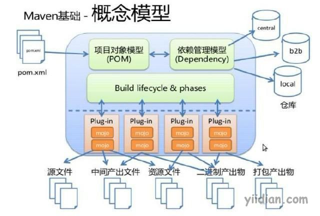

# 什么是maven？

## **1 什么是Maven？**

Maven是基于项目对象模型(POM Project Object Model)，可以通过一小段描述信息（配置文件）来管理项目的构建、报告和文档的软件项目管理工具。

其官网地址为：[http://maven.apache.org](http://maven.apache.org /)

Maven翻译为“专家”、“内行”；是一个采用纯Java编写的开源项目管理工具，Maven采用了一种被称之为Project Object Model (POM)概念来管理项目，所有的项目配置信息都被定义在一个叫做POM.xml的文件中, 通过该文件Maven可以管理项目的整个声明周期，包括清除、编译、测试、报告、打包、部署等。目前Apache下绝大多数项目都已经采用Maven进行管理. 而Maven本身还支持多种插件，可以方便更灵活的控制项目, 开发人员的主要任务应该是关注业务逻辑并去实现它，而不是把时间浪费在学习如何在不同的环境中去依赖jar包、项目部署等。Maven正是为了将开发人员从这些任务中解脱出来而诞生的一个项目管理工具。

## **2 Maven模型**

