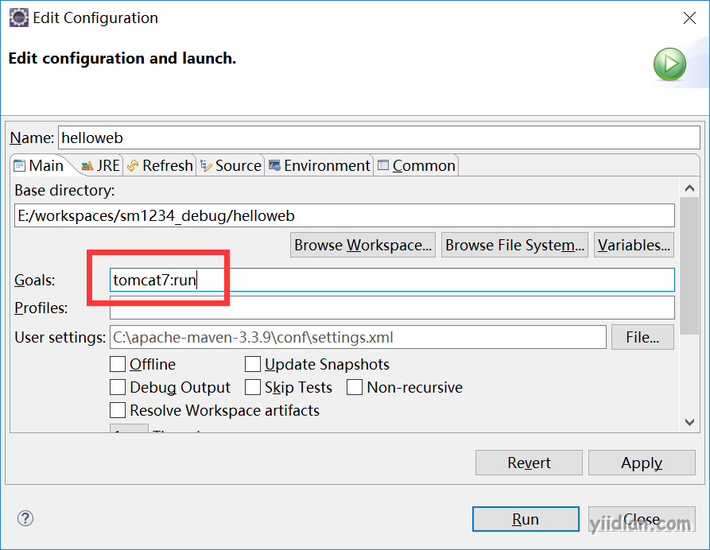

# maven插件使用

Maven的核心仅仅定义了抽象的生命周期，具体的任务都是交由插件完成的。


每个插件都能实现多个功能，每个功能就是一个插件目标。Maven的生命周期与插件目标相互绑定，以完成某个具体的构建任务。例如；compile就是插件maven-compiler-plugin的一个插件目标。

**1、添加打包项目源码的插件；运行install命令后在仓库中有项目的源码jar包**

```xml
<build>
		<plugins>
              <!-- 配置打项目源码包的插件 -->
			<plugin>
				<groupId>org.apache.maven.plugins</groupId>
				<artifactId>maven-source-plugin</artifactId>
				<version>2.2.1</version>
				<executions>
					<execution>
						<goals>
							<goal>jar-no-fork</goal>
						</goals>
						<phase>verify</phase>
					</execution>
				</executions>
			</plugin>
		</plugins>
</build>
```

**2、添加tomcat插件；以后可以针对项目快速配置多个不同端口的tomcat**

```xml
<!-- 配置Tomcat插件 -->
<plugin>
			<groupId>org.apache.tomcat.maven</groupId>
			<artifactId>tomcat7-maven-plugin</artifactId>
			<configuration>
				<port>8081</port>
				<path>/</path>
			</configuration>
</plugin>
```

运行tomcat；右击项目或者pom.xml，选择Run as --> Maven build...



**3、修改JDK编译版本**为1.8

```xml
<build>
		<plugins>
			<!-- java编译插件 -->
			<plugin>
				<groupId>org.apache.maven.plugins</groupId>
				<artifactId>maven-compiler-plugin</artifactId>
				<version>3.2</version>
				<configuration>
					<source>1.8</source>
					<target>1.8</target>
					<encoding>UTF-8</encoding>
				</configuration>
			</plugin>
		</plugins>
</build>
```

 