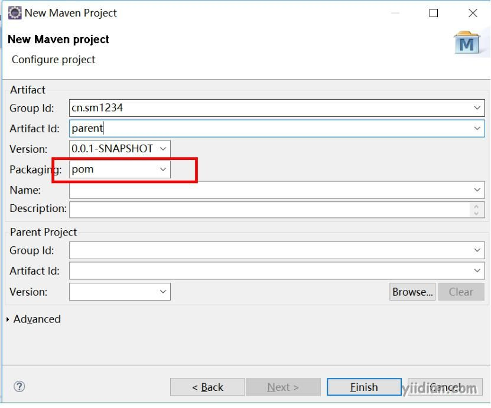
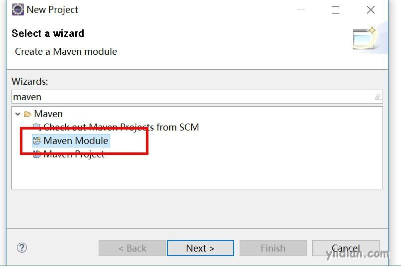

# maven继承与聚合

## **1 Maven继承**

继承为了消除重复，可以把pom中很多相同的配置提取出来；如：grouptId，version等。在使用的时候子工程直接继承父工程的依赖版本号，子工程中不再需要指定具体版本号，方便统一管控项目的依赖版本问题。

### **1.1 父工程的设置**

1）父工程的pom.xml中的打包方式必须设置为pom方式；

2）设置依赖管理

```xml
<project xmlns="http://maven.apache.org/POM/4.0.0" xmlns:xsi="http://www.w3.org/2001/XMLSchema-instance"
	xsi:schemaLocation="http://maven.apache.org/POM/4.0.0 http://maven.apache.org/xsd/maven-4.0.0.xsd">
	<modelVersion>4.0.0</modelVersion>
	<groupId>cn.sm1234</groupId>
	<artifactId>parent</artifactId>
	<version>0.0.1-SNAPSHOT</version>
	<packaging>pom</packaging>

	<!-- 集中定义依赖版本号 -->
	<properties>
		<junit.version>4.10</junit.version>
		<spring.version>4.1.0.RELEASE</spring.version>
		<slf4j.version>1.6.4</slf4j.version>
	</properties>

	<!-- 版本锁定，当子工程中有需要并且自行添加了具体依赖后才有效 -->
	<dependencyManagement>
		<dependencies>
			<!-- 单元测试 -->
			<dependency>
				<groupId>junit</groupId>
				<artifactId>junit</artifactId>
				<version>${junit.version}</version>
				<scope>test</scope>
			</dependency>

			<!-- Spring -->
			<dependency>
				<groupId>org.springframework</groupId>
				<artifactId>spring-context</artifactId>
				<version>${spring.version}</version>
			</dependency>
			<dependency>
				<groupId>org.springframework</groupId>
				<artifactId>spring-beans</artifactId>
				<version>${spring.version}</version>
			</dependency>

			<dependency>
				<groupId>org.springframework</groupId>
				<artifactId>spring-aspects</artifactId>
				<version>${spring.version}</version>
			</dependency>

			<dependency>
				<groupId>org.slf4j</groupId>
				<artifactId>slf4j-log4j12</artifactId>
				<version>${slf4j.version}</version>
			</dependency>

		</dependencies>
	</dependencyManagement>
</project>
```

### **1.2 子工程的设置**

在子工程中的pom.xml需要设置父工程：

```xml
<project xmlns="http://maven.apache.org/POM/4.0.0" xmlns:xsi="http://www.w3.org/2001/XMLSchema-instance"
	xsi:schemaLocation="http://maven.apache.org/POM/4.0.0 http://maven.apache.org/xsd/maven-4.0.0.xsd">
	<modelVersion>4.0.0</modelVersion>
	<!-- 父工程 -->
	<parent>
		<groupId>cn.sm1234</groupId>
		<artifactId>parent</artifactId>
		<version>0.0.1-SNAPSHOT</version>
		<!-- 父项目的pom.xml文件的相对路径；一般可不指定 -->
		<relativePath>../parent</relativePath>
	</parent>

	<groupId>cn.sm1234</groupId>
	<artifactId>sm1234-C</artifactId>
	<version>0.0.1-SNAPSHOT</version>

	<!-- 依赖 -->
	<dependencies>

		<dependency>
			<groupId>junit</groupId>
			<artifactId>junit</artifactId>
			<!-- 版本号由父工程里面统一指定不再需要特别指定，子工程需要指定GA -->
			<!-- <version>${junit.version}</version> -->
			<scope>test</scope>
		</dependency>
	</dependencies>
</project>
```

**relativePath：**父项目的pom.xml文件的相对路径。默认值为../pom.xml。maven首先从当前构建项目开始查找父项目的pom文件，然后从本地仓库，最后从远程仓库。RelativePath允许你选择一个不同的位置；一般Eclipse找不到parent项目时可以先update project，还不行则可配置此项。

## **2 聚合**

如果想一次构建多个项目模块，那则需要对多个项目模块进行聚合

```xml
<modules>
    <module>../子项目名称1</module>
    <module>../子项目名称2</module>
     <module>../子项目名称3</module>
</modules>
```

Ecplise种创建聚合模块

