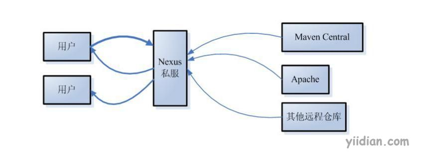

# 为什么使用私服？

为什么要使用私服？有以下三个理由

1. 缓存Maven中央仓库的jar包，这样不需要每次本地仓库没有jar包就无需到中央仓库下载，而是到私服下载。
2. 有些公司无法上网，那如何连接中央仓库呢？只需连接私服，而私服能连网到中央仓库。
3. 方便公司内部不同团队或者项目共享jar包，需要共享jar包，可以上传到私服，通过私服共享。

**附录：关于中央仓库注意事项**
**地址:** 目前来说: http://repo1.maven.org/maven2/是真正的Maven中央仓库的地址，该地址内置在Maven的源码中，其他的都是镜像。
**索引:** 中央仓库带有索引文件以方便用户对其进行搜索，完整的索引文件大小约为60M，索引每周更新一次。
**黑名单:** 如果某个IP地址恶意的下载中央仓库内容，例如全公司100台机器使用同一个IP反复下载，这个IP（甚至是IP段）会进入黑名单，因此稍有规模的使用Maven时，应该用Nexus架设私服。