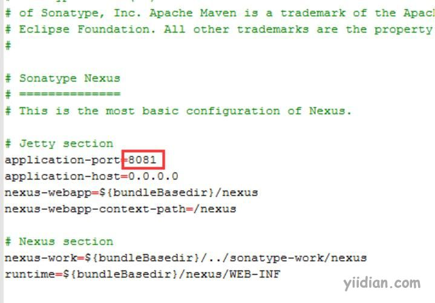
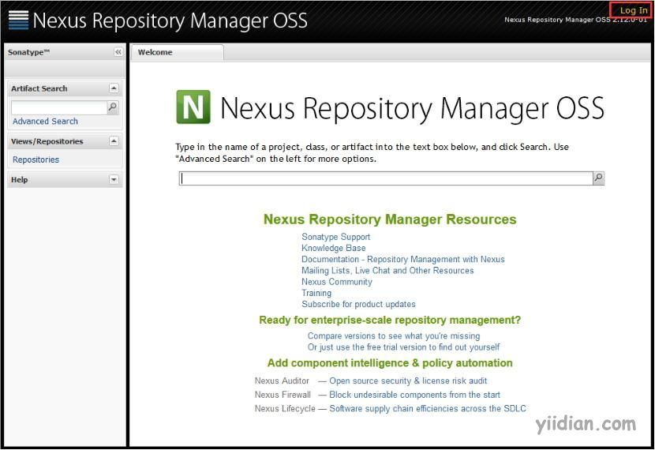
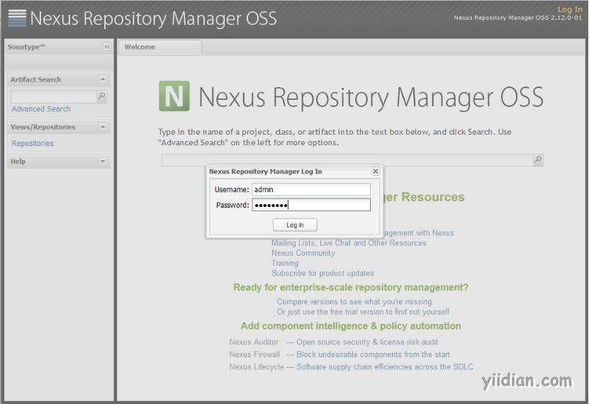
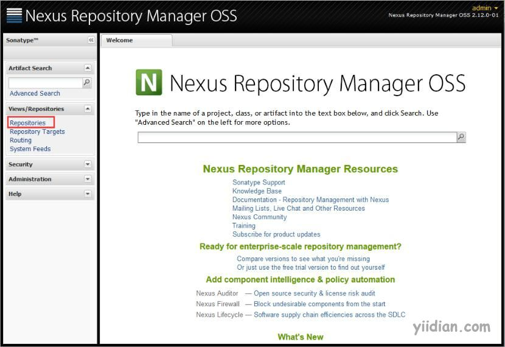
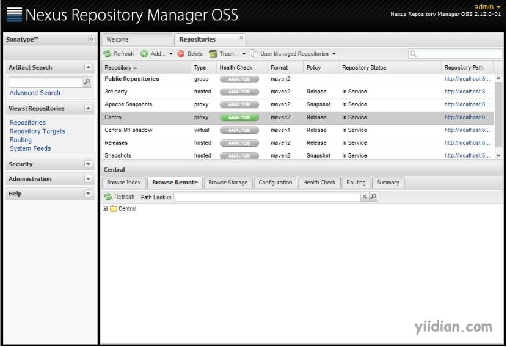
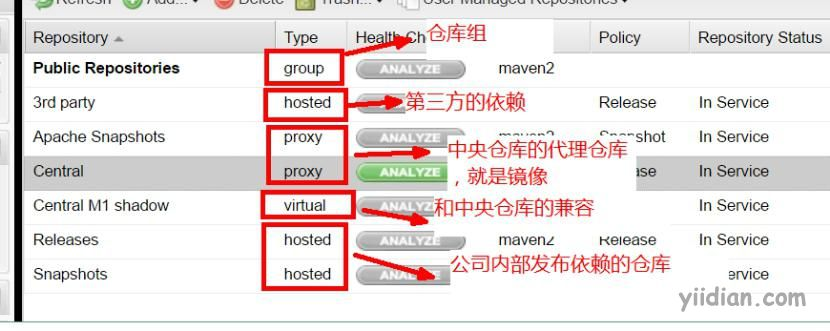

# nexus私服安装与配置

## **1 下载Nexus**

Nexus的官网 ：http://www.sonatype.com/

也可以到这个地址下载：http://pan.baidu.com/s/1pKFEzv9

下载Nexus Repository Manager OSS 2.xx。

## **2 Nexus安装**

解压“nexus-2.12.0-01-bundle.zip”；Nexus默认的端口可以在配置文件中修改，路径为：nexus-2.12.0-01\conf\nexus.properties；里面的内容如下：

## 

## **3 Nexus启动**

在路径“nexus-2.12.0-01\bin\jsw\windows-x86-64\”目录下：双击`console-nexus.bat`为后台启动Nexus；双击“install-nexus.bat”则会注册为一个windows服务。

## **4 Nexus访问**

当Nexus启动后，可以在浏览器中输入：http://localhost:8081/nexus

点击“Log In”

输入默认的帐号：admin，密码：admin123

点击“Repositories”浏览各个仓库。

 

## **5 Nexus的仓库**

### **5.1 仓库类别**

nexus里可以配置3种类型的仓库和组，分别是proxy、hosted、virtual、group。

- proxy：是远程仓库的代理。比如说在nexus中配置了一个central repository的proxy，当用户向这个proxy请求一个artifact，这个proxy就会先在本地查找，如果找不到的话，就会从远程仓库下载，然后返回给用户，相当于起到一个中转的作用。
- Hosted：是宿主仓库，用户可以把自己的一些构件，deploy到hosted中，也可以手工上传构件到hosted里。比如说oracle的驱动程序，ojdbc6.jar，在central repository是获取不到的，就需要手工上传到hosted里。
- virtual：也是中央仓库镜像,支持M1老版本。
- Group：是仓库组，在maven里没有这个概念，是nexus特有的。目的是将上述多个仓库聚合，对用户暴露统一的地址，这样用户就不需要在pom中配置多个地址，只要统一配置group的地址就可以了右边那个Repository Path可以点击进去，看到仓库中artifact列表。

### **5.2 具体仓库**

3rd party: 无法从公共仓库获得的第三方发布版本的构件仓库
Apache Snapshots: 用了代理ApacheMaven仓库快照版本的构件仓库
Central: 用来代理maven中央仓库中发布版本构件的仓库
Central M1 shadow: 用于提供中央仓库中M1格式的发布版本的构件镜像仓库
Releases: 用来部署管理内部的发布版本构件的宿主类型仓库
Snapshots:用来部署管理内部的快照版本构件的宿主类型仓库

