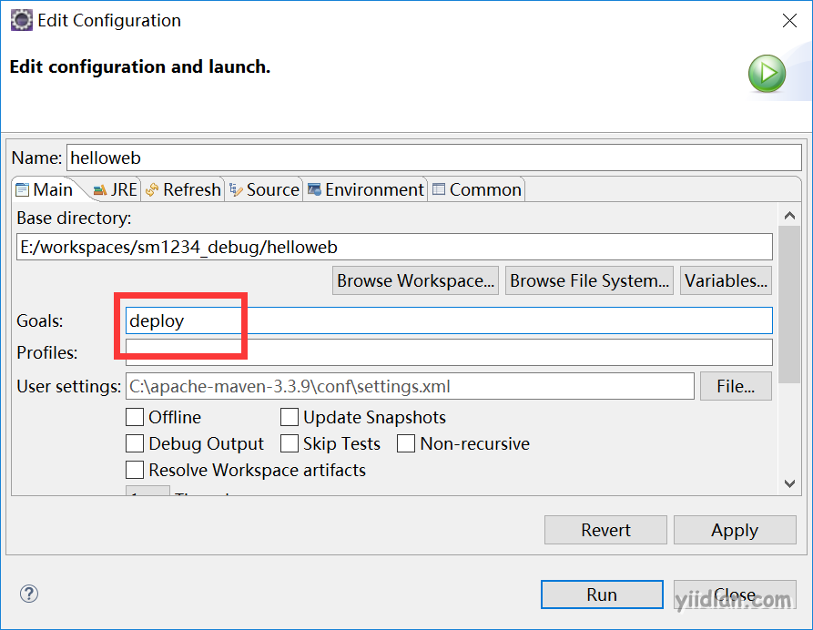

# 使用nexus上传下载资源

## **1 从Nexus私服中下载资源**

找到maven配置文件settings.xml文件，添加如下配置：

```xml
 <mirror>
		 <!--此处配置所有的构建均从私有仓库中下载 *代表所有，也可以写central等和仓库配置id一致的内容 -->
		 <id>nexus</id>
		 <mirrorOf>*</mirrorOf>
		 <url>http://localhost:8081/nexus/content/groups/public/</url>
</mirror>
```

## **2 上传资源到Nexus私服**

当项目完成后如果需要deploy部署jar包到私服，则可以添加如下配置：

### **2.1 pom.xml中添加上传配置**

```xml
<!-- 构建部署项目 -->
<distributionManagement>
		<repository>
			<id>releases</id>
			<name>Internal Releases</name>
			<url>http://localhost:8081/nexus/content/repositories/releases/</url>
		</repository>
		<snapshotRepository>
			<id>snapshots</id>
			<name>Internal Snapshots</name>
			<url>http://localhost:8081/nexus/content/repositories/snapshots/</url>
		</snapshotRepository>
</distributionManagement>
```

### **2.2 添加nexus的帐号信息**

```xml
<server>
 		<id>releases</id>
		<username>admin</username>
		<password>admin123</password>
	</server>
	<server>
		<id>snapshots</id>
		<username>deployment</username>
		<password>deployment123</password>
</server>
```

在项目中右击选择run asmaven build… 然后在Goals中输入` deploy `将项目的包部署上传到私服。

