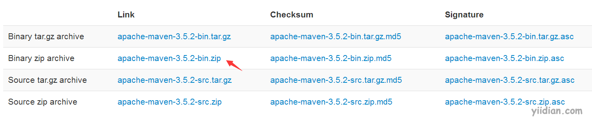
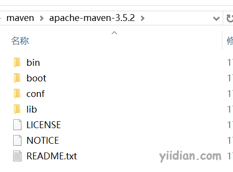
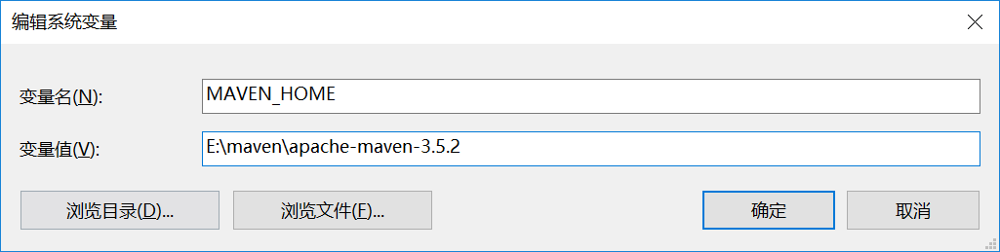
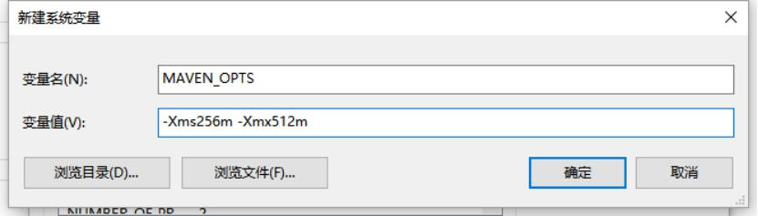
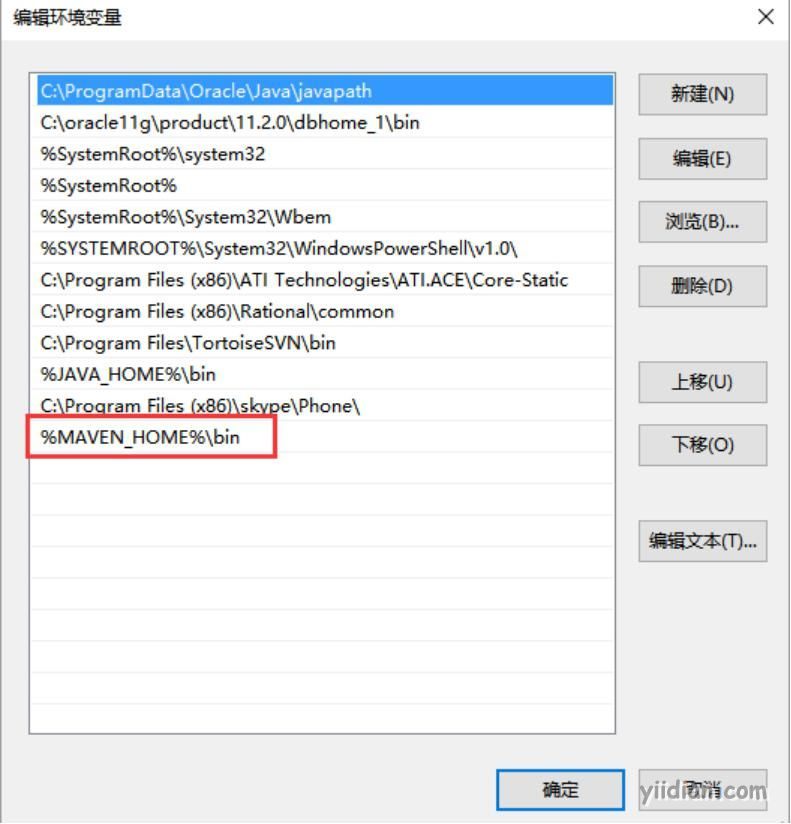
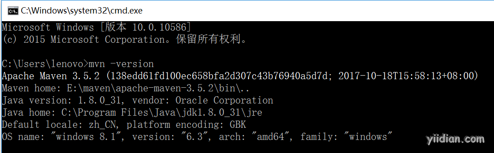
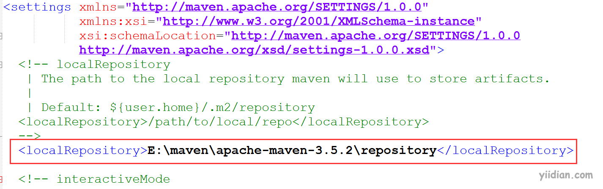

# maven的安装与配置

环境要求：Maven 3.5+ 需要使用jdk 1.7+

## **1 下载Maven**

下载地址：http://maven.apache.org/download.cgi

## **2 解压文件**

解压maven压缩包“apache-maven-3.5.2.bin.zip”到一个路径（尽量编码路径中不要包含中文）

- bin：含有mvn运行的脚本
- boot：含有plexus-classworlds类加载器框架
- lib：含有Maven运行时所需要的java类库
- conf：含有settings.xml配置文件
- settings.xml 中默认的用户库: ${user.home}/.m2/repository[通过maven下载的jar包都会存储到此仓库中]

## **3 添加环境变量MAVEN_HOME**

MAVEN_HOME : E:\maven\apache-maven-3.5.2-bin（注意：配置为你自己的maven路径）

MAVEN_OPTS : -Xms256m -Xmx512m（`注意：可以不配置`）

## 

## **4 设置系统环境变量Path**

在Path中追加: %MAVEN_HOME%\bin

## 

## **5 验证是否安装成功**

打开 cmd 输入：`mvn -version`

## **6 配置本地仓库**

Maven的默认本地仓库在：`${user.home}/.m2/repository`；这地址可以在settings.xml中修改指定自定义的仓库路径。

【自定义仓库路径】
找到`${maven_home}/conf/settings.xml`文件，修改如下：

需要注意的是上图中的自定义路径必须存在。repository是本地仓库，也即本地下载的jar存放路径。