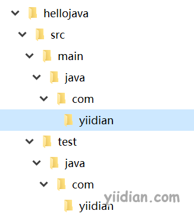
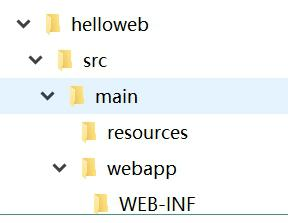
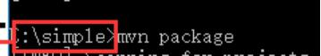

# 命令行构建maven项目

## **1 使用命令行创建java项目**

在命令行中可以通过Maven中的命令（插件）可以自动创建文件结构和自动生成pom.xml文件。


执行以下cmd命令：

```bash
mvn archetype:generate  -DarchetypeCatalog=internal  -DgroupId=com.yiidian -DartifactId=hellojava -DarchetypeArtifactId=maven-archetype-quickstart -Dversion=0.0.1-snapshot
```

执行后结果：



参数说明：
 \#核心命令 mvn 框架:生成 即生成Maven项目最基本的目录结构
 mvn archetype:generate
 \#读取archetype-catalog.xml文件的位置；内置的
 -DarchetypeCatalog=internal
 \#公司域名倒写
 -DgroupId=com.yiidian
 \#项目名称
 -DartifactId=hellojava
 \#Maven项目的模板；最简单的Maven项目模板
 -DarchetypeArtifactId=maven-archetype-quickstart
 \#项目版本号，snapshot 内测版，release 正式发行版
 -Dversion=0.0.1-snapshot

## **2 使用命令行创建web项目**

创建web项目时，不但创建目录结构和pom.xml，并创建webapp目录放置web资源文件。

执行以下cmd命令：

```bash
mvn archetype:generate  -DarchetypeCatalog=internal  -DgroupId=com.yiidian -DartifactId=helloweb -DarchetypeArtifactId=maven-archetype-webapp -Dversion=0.0.1-snapshot
```

执行后结果：



参数说明：
 \#核心命令 mvn 框架:生成 即生成Maven项目最基本的目录结构
 mvn archetype:generate
 \#读取archetype-catalog.xml文件的位置；内置的
 -DarchetypeCatalog=internal
 \#公司域名倒写
 -DgroupId=com.yiidian
 \#项目名称
 -DartifactId=helloweb
 \#Maven项目的模板；Maven web项目模板
 -DarchetypeArtifactId=maven-archetype-webapp
 \#项目版本号
 -Dversion=0.0.1-snapshot

## **3 构建Maven项目命令的使用** 

注意：先进入项目目录后再操作！



| 命令        | 说明                                                         |
| ----------- | ------------------------------------------------------------ |
| mvn clean   | 清除原来的编译结果                                           |
| mvn compile | 编译                                                         |
| mvn test    | 运行测试代码；mvn test -Dtest=类名//单独运行测试类           |
| mvn package | 打包项目；mvn package -Dmanven.test.skip=true//打包时不执行测试 |
| mvn install | 将项目打包并安装到本地仓库                                   |
| mvn deploy  | 发布到本地仓库或者服务器                                     |

 