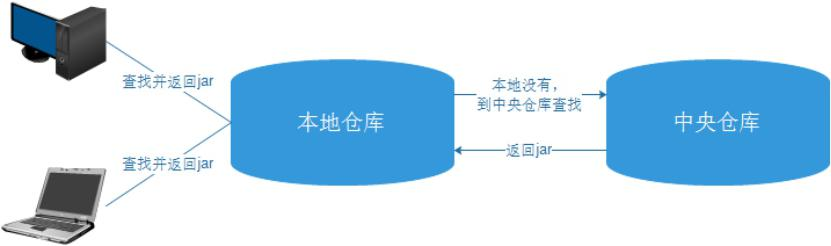
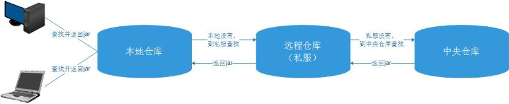

# 什么是maven仓库？

Maven在某个统一的位置存储所有项目的共享的构件，这个统一的位置，就称之为`仓库`。（仓库就是存放依赖和插件的地方）Maven的仓库有两大类：

1. 本地仓库
2. 远程仓库，在远程仓库中又分成了3种：中央仓库、私服、其它公共库。

**本地仓库：**就是Maven在本机存储构件的地方。maven的本地仓库，在安装maven后并不会创建，它是在第一次执行maven命令的时候才被创建。maven本地仓库的默认位置：在用户的目录下都只有一个.m2/repository/的仓库目录；可以修改。

**中央仓库：**包含了绝大多数流行的开源Java构件，以及源码、作者信息、SCM、信息、许可证信息等。开源的Java项目依赖的构件都可以在这里下载到。
中央仓库的地址：http://repo1.maven.org/maven2/

**私服：**是一种特殊的远程仓库，它是架设在局域网内的仓库。

 

**没有使用私服的仓库构件下载**

**使用私服的仓库构件下载**

