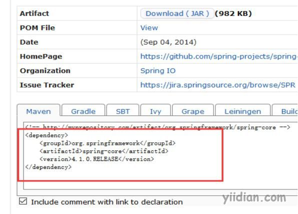

# 什么是maven坐标？

## **1 什么是坐标？**

在平面几何中坐标（x,y）可以标识平面中唯一的一点

## **2 Maven坐标主要组成**

groupId：定义当前Maven项目隶属项目、组织
artifactId：定义实际项目中的一个模块
version：定义当前项目的当前版本
packaging：定义该项目的打包方式（pom/jar/war，默认为jar）
groupId、artifactId、version简称为GAV。

## **3 Maven为什么使用坐标？**

Maven世界拥有大量构件，需要找一个用来唯一标识一个构建的统一规范
拥有了统一规范，就可以把查找工作交给机器

## **4 如何获取Maven坐标**

推荐一个Maven坐标查询网站：http://mvnrepository.com/

网站上可以搜索具体的组织或项目关键字，之后复制对应的坐标到pom.xml中。如：

