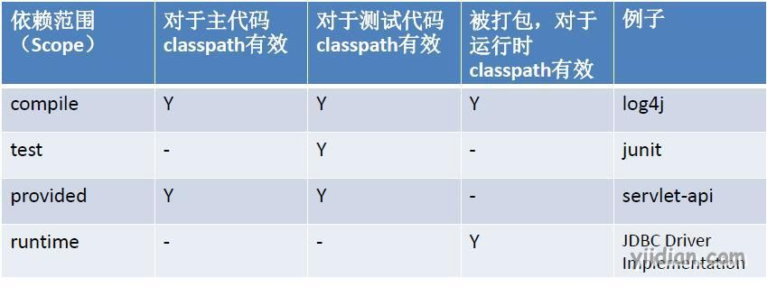
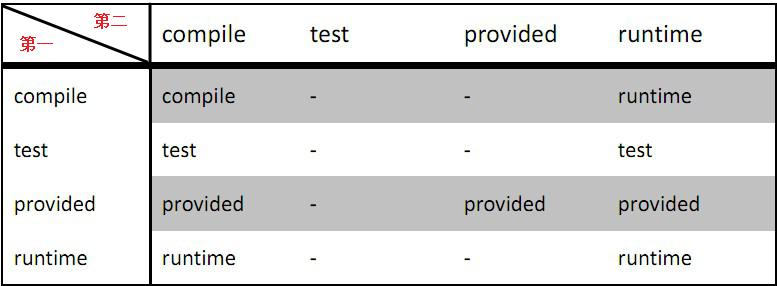
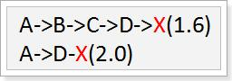
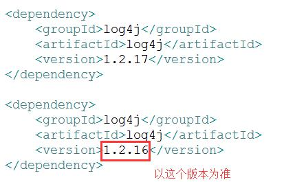

# maven依赖管理

## **1 依赖范围**

依赖范围`scope` 用来控制依赖和编译，测试，运行的classpath的关系。具体的依赖范围有如下6种：

1. compile： 默认编译依赖范围。对于编译，测试，运行三种classpath都有效
2. test：测试依赖范围。只对于测试classpath有效
3. provided：已提供依赖范围。对于编译，测试的classpath都有效，但对于运行无效。因为由容器已经提供，例如servlet-api
4. runtime：运行时提供。例如:jdbc驱动
5. system：系统范围,自定义构件，指定systemPath；跟provided 相似，但是在系统中要以外部JAR包的形式提供，maven不会在repository查找它。
6. import：只使用在<dependencyManagement>中，表示从其它的pom中导入dependency的配置。

 

## **2 传递性依赖**

假设 C 依赖 B ， B 依赖 A ，那么称 C 对 B 是第一直接依赖， B 对 A 是第二直接依赖， C 对 A 是传递依赖。

对于传递性依赖，依赖的范围如下表：



## **3 可选依赖**

在依赖节点dependency中的`<optional>`可以控制当前的依赖是否向下传递；默认值为false，表示向下传递。

【示例】A项目依赖于log4j，然后B项目依赖于A项目；那么如果在A中对log4j依赖的optional配置成false时，B项目中自动传递依赖于log4j。否则反之。

1）项目A配置slf4j的依赖并设置optional为true

```xml
 <dependency>
            <groupId>org.slf4j</groupId>
            <artifactId>slf4j-log4j12</artifactId>
            <version>1.6.4</version>
            <!-- 配置为true时不向下传递此依赖，默认为false -->
            <optional>true</optional>
 </dependency>
```

2）配置项目B依赖于项目A，检查项目B的依赖包

```xml
<!-- 依赖于A -->
<dependency>
        <groupId>com.yiidian</groupId>
        <artifactId>A</artifactId>
         <version>0.0.1-SNAPSHOT</version>
</dependency>
```

这时发现B项目没有依赖slf4j-log4j12

## **4 依赖冲突**

- 如果直接与间接依赖中包含有同一个坐标不同版本的资源依赖，以直接依赖的版本为准（就近原则）



***最终A依赖的X的版本为2.0\***

【比如】：项目A中，依赖了slf4j1.6.4版本的包，通过slf4j1.6.4间接依赖log4j1.2.16版本；如果项目A中直接配置了log4j 1.2.17版本，那么最终的版本为1.2.17。

```xml
<dependency>
	<groupId>org.slf4j</groupId>
	<artifactId>slf4j-log4j12</artifactId>
	<version>1.6.4</version>
	<!-- 配置为true时不向下传递此依赖，默认为false -->
	<optional>true</optional>
</dependency>
<dependency>
	<groupId>log4j</groupId>
	<artifactId>log4j</artifactId>
	<version>1.2.17</version>
</dependency>
```

- 如果直接依赖中包含有同一个坐标不同版本的资源依赖，以配置顺序下方的版本为准



- 如果间接依赖中包含有同一个坐标不同版本的资源依赖，以配置顺序上方的版本为准

​      如下对应spring-core的间接依赖的版本号，以struts2-spring-plugin为准

```xml
<dependency>
	<groupId>org.apache.struts</groupId>
	<artifactId>struts2-spring-plugin</artifactId>
	<version>2.3.24.1</version>
</dependency>
<dependency>
	<groupId>org.springframework</groupId>
	<artifactId>spring-beans</artifactId>
	<version>4.1.0.RELEASE</version>
</dependency>
```

## **5 排除依赖**

在pom中的依赖节点中，如果引入的依赖包含了很多其它的传递依赖，而且项目需要的这些依赖的版本和传递依赖的不相符；那么可以在依赖节点中设置排除依赖节点：`<exclusions> `然后再添加 <exclusion>，其里面的内容包括：
①所包含坐标
②排除依赖包中所包含的依赖关系
【注意】不需要添加版本，直接按照类别排除

```xml
<dependency>
			<groupId>org.apache.struts</groupId>
			<artifactId>struts2-spring-plugin</artifactId>
			<version>2.3.24.1</version>
			<exclusions>
				<!-- 排除spring-core的传递依赖 -->
				<exclusion>
					<groupId>org.springframework</groupId>
					<artifactId>spring-core</artifactId>
				</exclusion>
			</exclusions>
</dependency>

<dependency>
			<groupId>org.springframework</groupId>
			<artifactId>spring-beans</artifactId>
			<version>4.1.0.RELEASE</version>
</dependency>
```

 