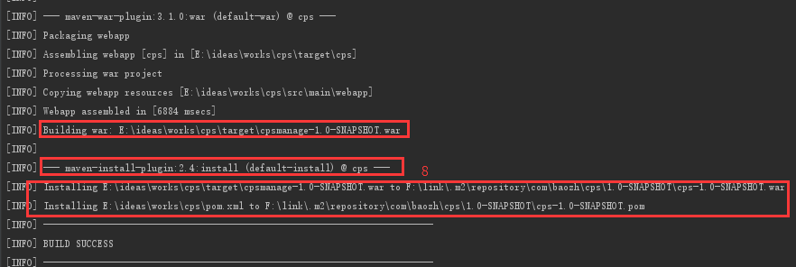

## mvn clean package

先看命令的执行过程

 

## mvn clean install

同样先看执行过程

- mvn clean package依次执行了clean、resources、compile、testResources、testCompile、test、war(jar)(打包)７个阶段;
- mvn clean install依次执行了clean、resources、compile、testResources、testCompile、test、war(jar)(打包)、install8个阶段;
-  maven-war-plugin将工程打包成war，而maven-install-plugin会将打好的war包放入本地开发环境的maven版本库中。